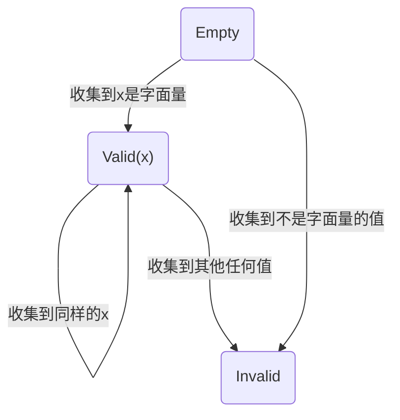

# 字面量内联

### 基本思路

每个 Expression AST Node 都有唯一的一个 LiteralCollector，用于收集表达式计算出的值，以确定一个它是否可以用字面量表示。

LiteralCollector 有三种状态：



如果 LiteralCollector 处于 Valid 状态，那么该表达式的值就是字面量本身的 Entity。比如原本表达式计算为 `ComputedEntity(LiteralEntity::Number(1), SomeConsumable)`，若收集成功，就只需返回 `LiteralEntity::Number(1)`，不再追踪 `SomeConsumable`；若收集失败，仍旧返回原本计算的值（这一点在下文会被推翻）。

LiteralCollector 会被保留到 Transformer 阶段。此时如果会去 Transform 这个节点，那么其 LiteralCollector 肯定不是在 Empty 状态。若它在 Valid 状态，那么无论该表达式是否需要值 (即无论 `need_val` 的值)，都以不需要值的模式执行原本的转换逻辑，只需要该表达式的副作用（记为 `side_effect`）。若表达式需要值，则返回 SequenceExpression `(side_effect, collect_literal)`，否则，直接返回 `side_effect`。

### 致命问题

但是以上方式有一个致命的问题，以下面的输入为例：

```js
function f(a) {
  globalThis.a = a;
}
f(1);
f(x);
```

会被转换为：

```js
function f(a) {
  globalThis.a = a + 1;
}
f();
f(x);
```

这是因为，第一次调用 `f` 的时候，`a + 1` 被认为可以用 `2` 表示，因此就不再追踪这次调用的参数 `1`。虽然这在第二次调用 `f` 时否定了这一点，但是在第一次调用 `f` 时无法预知后面的情况。

### 修复问题

为了修复这种问题，需要引入 CollectedEntity。即，在收集后处于 Valid 状态时，虽然 LiteralCollector 仍旧返回简单的字面量值，但会把原本的 entity 收集起来。如果后续一直都是 Valid 状态，那么最终这个表达式就会变成该字面量，这些收集起来的原始计算值一点用也没有。当 LiteralCollector 收集后是 Invalid 状态，则返回一个 CollectedEntity。该 CollectedEntity 会把作用在原 entity 上的操作，同样地作用在之前收集到的那些 entity 上。以上例为例，第二次调用 `f` 时，`a+1` 收集后进入 Invalid 状态，会返回如下的 CollectedEntity:

```rust
CollectedEntity(
  // 当前计算出的 entity
  ComputedEntity(Unknown, vec![a_and_x, LiteralEntity::Number(1)]),

  // 之前收集到的 entity
  vec![
    ComputedEntity(LiteralEntity::Number(2), vec![a_and_1, LiteralEntity::Number(1)]),
  ]
)
```

此时，当它被赋值到 `globalThis.a`，失去追踪时，就会连同之前收集到的 `a_and_1` 一起消耗掉了，第一次函数调用的参数就会被正确地保留。

### 优化

第一个优化是显然的。`CollectedEntity(x, vec![])` 等价于 `x` 本身，故只需在收集到的 entity 非空时，才需要使用 CollectedEntity。

第二个优化比较特别。因为其他的优化，使得即使不做该优化，对性能的影响也很小。但是由于比较有趣，而且以及这么实现了，故记录于此。

上文中，假设收集到的 entity 非空，那么在进入 Invalid 状态后，我们每次都把返回的值都用 CollectedEntity 包装，但是其实并不需要。只有第一次，即从 Valid 变为 Invalid 的那一次，需要包装，后续的直接返回原来的 entity 即可。我不知道怎么证明这一点。
